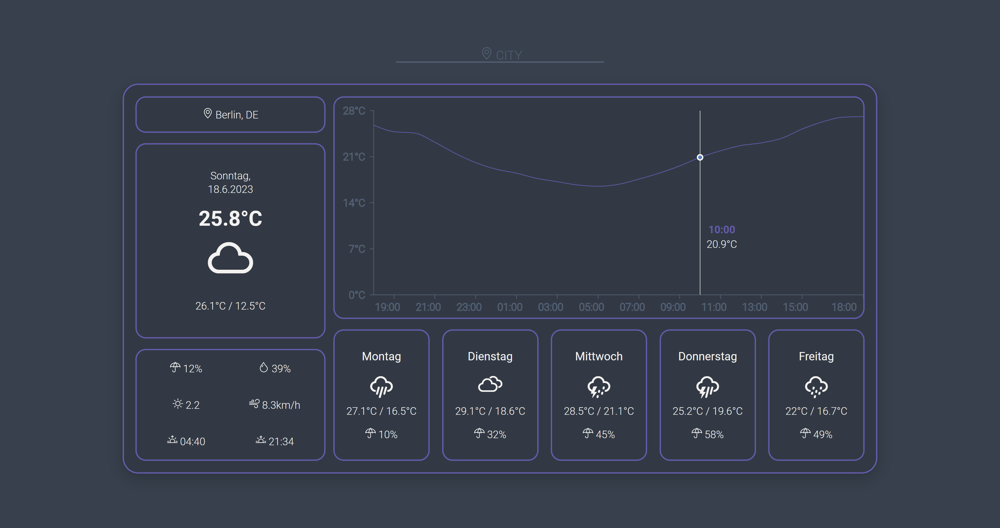

<h1 align="center">
  Weather Dashboard 🌤
<br>
</h1>

<p align="center">

</p>

This GitHub repository is the result of a fun and educational React exercise I undertook to enhance my frontend development skills. The Weather Dashboard is a sleek and intuitive application that provides you with up-to-date weather information for any location around the world.

With this dashboard, you can effortlessly check the current weather conditions, including temperature, humidity, wind speed, and more. The interface is designed to be user-friendly and minimalistic, allowing you to quickly search for any city or region and get accurate weather data in real time.

You can see the application in action and lookup your weather information by checking out the [live demo](https://kecioch.github.io/weather-dashboard).

# Features

- Fetch current weather information
- Simple and minimalistic design
- Search for any city you want
- Updating data in an interval each hour
- Get weather information depending on your current geolocation
- Preview of the next 5 days
- Temperature curve for the next 24 hours

# Setup

```bash
# Clone repository
$ git clone https://github.com/kecioch/weather-dashboard

# Navigate into repository
$ cd weather-dashboard

# Install dependencies
$ npm i

# Start the application
$ npm run start
```

# Technologies
- [React](https://reactjs.org/)

# External Library
- [Weather-Icons by Erik Flowers](https://github.com/erikflowers/weather-icons)

# APIs
- [Open-Meteo](https://open-meteo.com/)
- [Geocode.Maps](https://geocode.maps.co/)
